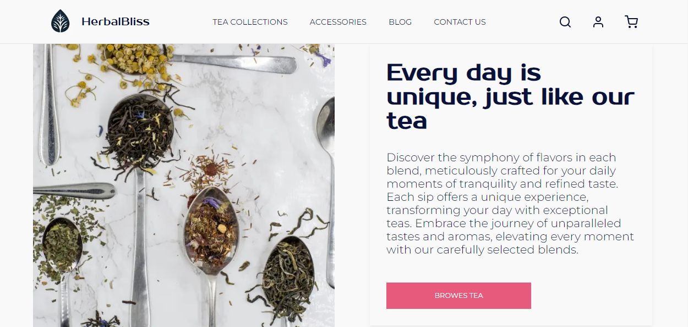

# Tea Shop - Online Store Mockup

## Overview

Welcome to the Tea Shop application mockup. This early-stage project is designed to simulate an online store for teas and related products, focusing on a user-friendly experience and a visually appealing interface.

## Introduction

As a mockup, this project serves as a blueprint for an online tea shop. It is currently in the development phase, concentrating on core structure and layout. The goal is to create a comprehensive online shopping experience that caters to tea enthusiasts.

## Features

The home page of the Tea Shop includes key features such as:

- A visually appealing and welcoming interface.
- Sections providing detailed information about the tea shop and its products.
- A showcase area for various tea collections, inviting users to browse.
- A placeholder for future blog posts related to tea and brewing techniques.
- Dedicated areas designed for different customer groups, including a section for wholesale buyers.

## Technology Stack

The application is built with:

- **Next.js**: Leveraged for server-side rendering and static web applications.
- **TypeScript**: Used for its enhanced code quality and readability.

## Adding an Image to the README

